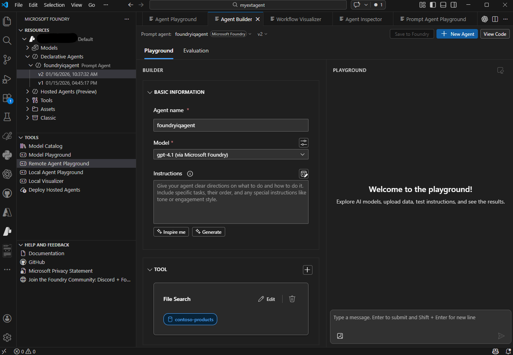

# Development Approaches

## Foundry Portal Dev

Web-based interface for creating and managing AI agents without writing code

When to choose: 
- Rapid test agent concepts and config without setting up dev environments
- Configure agent through intuitive forms and dropdowns
- View and manage all agents across projects in one place
- Share agent config with stakeholders who prefer visuals
- Monitor token usage, latency, and evaluation outcomes in dashboards

No additional tools required

## Visual Studio Code Dev

Microsoft Foundry extension for vscode for devs

When to choose:
- Developer centric workflow in a single environment
- Version control integration with Git for agent configurations
- Rapid iteration through agile changes and testing while maintaining developer tools
- Code-first development with YAML config for precise control
- Local Dev for offline agent designes before deploying to Azure

## Key Capabilities:

### Resources

Browse and manage Foundry project assets from VS Code

- Deployed models: View and manage model deployments
- Declarative agents: View and configure prompt-based and workflow agents
- Hosted agents: View and manage containerized, code deployed agents
- Connections: Manage connections to external services
- Vector stores: Organize document collections for File Search

06-22-2026:
- Recent Agents
- Local Resources
- Microsoft Foundry Resources
- Connected Resources

### Developer Tools

Access development and testing capabilities

- Model Catalog: Browse and deploy models from catalog
- Model Playground: Experiment with models directly
- Agent Playground: Test agents using remove or local playground
- Local Visualizer: Debug and visualize agent behavior locally
- Deployed Hosted Agents: Deploy containerized agents to production

06-22-2026
- Discover
- Build
- Monitor

### Help and Feedback

Access documentation and support resources

06-22-2026
- Ask Copilot
- Get Started
- View Documentation
- What's New
- Report Issues
- Join Community

### Agent Designer

Agent Designer is available in the extension to 
- configure agent properties
- integrate code generation for application integration
- direct YAML configuration editing for precise control

## VSCode or Foundry Portal Workflow

1. Connect Miscrosoft Foundry project
2. Create an AI agent in Foundry portal with descriptive name and purpose
3. Configure agent instructions in portal or vscode
4. Add tools to agent
5. Test agent using integrated playgrounds
6. Iterate on deisgn, based on test results
7. Deploy agent to production
8. Integrate agent into applications

## Required Azure Resources

1. Microsoft Foundry project
2. Model deployments within the project

## Optional Azure Services

- Azure AI Search: Advanced knowledge retrieval with FOundry IQ or File Search tool
- Azure Storage: Store and manage files that agent can access
- Azure Key Vault: Securely manage secrets and credentials
- Azure Functions: Custom tool implementations and business logic

## Choosing Deployment Approach

Depends on 
- workflow preferences
- team composition
- integration requirements

Some teams use both approaches
- portal for initial exploration and stakeholder reviews
- vscode for detailed dev and prod deployments