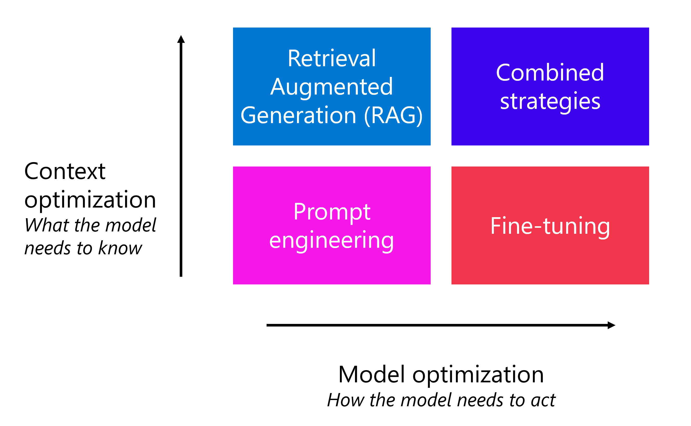

# Optimization Strategy

So far we explored the different ways we can optimize AI

- Prompt Engineering
- RAG
- Fine Tuning

Each strategy is not mutually exclusive and can be combined to mee different optimization goals

We have two Scales of measurements:
- Context optimization
- Model optimization

## Context optimization
- Model lacks domain-specific knowledge
- maximize accuracy of response

## Model optimization
- improve response format, style, or tone
- maximizing consistency of behavior

## Context and Model optimization
Prompt engineering is a foundation that supports both directions.
- instruct model how to behave
- instruct mode what to focus on
- layer RAG or fine-tuning when prompt engineering alone isnt sufficient

## Comparing Strategies

Each strategy has different trade-offs in terms of implementation time, complexity, cost, and what it does best:

### Prompt Engineering

- Time to implement: low
- Complexity: low
- Cost: low
- Best for: Guiding tone, format and behavior, quick iteration; providing instructions and examples

### RAG

- Time to implement: Medium
- Complexity: Medium
- Cost: Medium (search infra + storage + per-token)
- Best for: Factual accuracy, domain-specific knowledge, dynmamic or frequently changing data

### Fine-tuning
- Time to implement: High
- Compleixty: High
- Cost: High (training compute + model hosting + per-token)
- Best for: Behavioral consistency, style enforcement, reducing prompt length, model distillation(large model transfers learned knowledge to smaller model)

## Trade offs

### Prompt Engineering trade-offs

Prompt engineering is the quickest and least expensive optimization strategy. You can start immediately without any infrastructure changes.

However, longer prompts consume more tokens per request, and the model might not always follow complex instructions consistently.

Prompt engineering also can't give the model access to information it wasn't trained on.

### RAG trade-offs

RAG provides the model with up-to-date, relevant data at query time, which significantly improves factual accuracy.

However, it requires setting up a search service, creating and maintaining an index, and processing embeddings.

The quality of RAG responses depends on the quality of your search index and how well your data is chunked and indexed.

### Fine-tuning trade-offs

Fine-tuning produces the most consistent model behavior because the desired patterns are embedded in the model's weights. It can also reduce per-request costs by shortening prompts.

However, fine-tuning has the highest upfront investment: you need to prepare training data, pay for training compute, and host the custom model. 

The fine-tuned model may also need to be retrained when the base model is updated or when your requirements change.

## combining strategies

The most effective generative AI applications often use multiple strategies together. Here are common combinations:

### Prompt engineering + RAG

This is the most common combination.

Prompt engineering to define the model's behavior (through system messages and instructions) and RAG to provide the factual context needed for accurate responses.

For Example:
- The system message instructs the model to act as a travel advisor and format responses in a specific way
- RAG retrieves details from the hotel catalog so the model can answer with real hotel names and prices.

This addresses both how the model should act and what the model needs to know.

### Prompt Engineering + fine-tuning

Use this combination when you need the model to consistently follow a specific style or format.

The fine-tuned model handles the baseline behavior, and the system message provides additional per-conversation context. 

For example:
- The fine-tuned model is trained to always respond in the travel agency's brand voice.
- The system message adds session-specific instructions, such as giving priority to a seasonal promotion.

### RAG + fine-tuning

Combine these strategies when you need both factual grounding and consistent behavior.

The fine-tuned model ensures the response style is reliable, while RAG provides the current, domain-specific data.

For example:
- The fine-tuned model produces responses in the agency's brand voice and structured format.
- RAG retrieves up-to-date hotel pricing and availability from the catalog.

### Prompt Engineering + RAG + Fine-tuning

For the most demanding applications, you can use prompt engineering, RAG, and a fine-tuned model together.

Each layer handles a different concern:
- Fine-tuning ensures consistent style and format.
- RAG provides accurate, up-to-date domain knowledge.
- Prompt engineering adds conversation-specific instructions and guardrails.

## Decision framework

1. Start with prompt engineering: Test system messages, few-shot examples, and parameter tuning. Evaluate whether the results meet your requirements.
2. Add RAG if accuracy matters: If the model needs access to specific, current, or private data to answer correctly, implement RAG with Azure AI Search.
3. Add fine-tuning if consistency matters: If the model doesn't reliably maintain the desired style, tone, or format despite detailed prompts, fine-tune the model with representative examples.
4. Combine as needed: Layer strategies based on your application's specific requirements. Not every application needs all three.