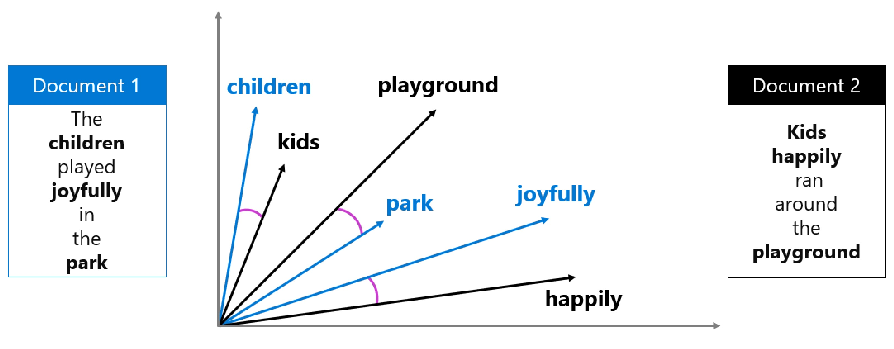

# RAG (Retrieval Augmented Generation)

Prompt engineering is only helpful for how a model respondes, but does not help with model knowledge.

LLM are trained on large datasets but trainign data has cutoff dates and doesnt have internal or private information

When model lacks relevant context, it might generate responses that sound plausible but are factually incorrect

## Addressing the challenge

Solution:
- Ground models by providing it relevant, factual data to base its response on
- RAG to ground a language model

## Understand grounding

LLM without grounding means info only comes from its training data.
- will show grammatically correct, logically structured, but inaccurate, fabricated details

When you ground a prompt you provide relevant data from a trusted source along wiht the user prompt.
- more accurate and relevant response

### Ungrounded
- rely only on training data and may make up details

### Grounded
- receive data/info as context and respond with real details

## How does RAG work?

RAG is a pattern that retrieves relevant info from a data source and includes it in the prompt before model generates a response

1. Retrieve: Search data source for info related to user prompt
2. Augment: add retrieved info to prompt as context
3. Generate: send augmented prompt to language model to genereate grounded response

This prevents models from relying only on old training data

### Stage 1: Create embeddings for search

Finding the most relevant info in data source is possible through embeddings and vector search.

Embedding - mathematical representation of text as a vector
- a floating-point numbers that captures meaning of words, sentences, or docs
- You can create embeddings by sending content to an embedding model



Cosine similarity measures how close two vectors are by calculating angle between them.

Value near 1 means vectors are very similar

### Stage 2: Retrieval component

Azure AI Search provides retrieval componenet for RAG solution
- bring your own data
- create searchable index
- query to retrieve relevant info

In order to use Azure AI Search you need to:
1. add data to microsoft foundry from data source
2. Create an index using embedding model to generate vector rep of content.
- Index is then stored in Azure AI Search
3. Query index when user asks question
- system convert question to embedding then search for similar content and returns relevant result using cosine similarity

### Stage 3: Azure AI Search Techniques

- Keyword search: Matches exact terms in the query to text in the index.
- Semantic search: Uses semantic models to match the meaning of the query rather than exact keywords.
- Vector search: Uses embeddings to find semantically similar content.
- Hybrid search: Combines keyword, semantic, and vector search for the most accurate results. Hybrid search is recommended for generative AI applications.

## When to use RAG:
- Model needs domain-specific knowledge
- Information changes frequently
- Factual accuracy is critical
- base mode training data has cutoff

Note:
```md
If you're building agents that need grounded knowledge without managing your own search infrastructure, consider **Foundry IQ** — a managed knowledge store that simplifies grounding for AI agents. To learn more, see Build knowledge-enhanced AI agents with Foundry IQ.
```